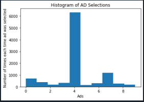

# Reinforcement-Learning    
Implementation of Upper Confidence Bound and Thopson Sampling algorithms. Reinforcement learning (RL) is an area of machine learning concerned with how intelligent agents ought to take actions in an environment in order to maximize the notion of cumulative reward. Reinforcement learning is one of three basic machine learning paradigms, alongside supervised learning and unsupervised learning.
Reinforcement learning differs from supervised learning in not needing labelled input/output pairs be presented, and in not needing sub-optimal actions to be explicitly corrected. Instead the focus is on finding a balance between exploration (of uncharted territory) and exploitation (of current knowledge).   

___

# Installations 

```python
    pip install pandas
    pip install numpy 
    pip install matplotlib
```   
___

# Table of Contents   

| S.N 	| Reinforcement Learning Algorithm 	| Dataset Used                   	|
|-----	|--------------------------------	|--------------------------------	|
| 1.  	| Upper Confidence Bound                        	| Ads_CTR_Optimisation.csv 	|
| 2.  	| Thompson Sampling                       	| Ads_CTR_Optimisation.csv 	|      

___

## Upper Confidence Bound Algorithm   


In Reinforcement learning, the agent or decision-maker generates its training data by interacting with the world. The agent must learn the consequences of its actions through trial and error, rather than being explicitly told the correct action.

### Multi-Armed Bandit Problem

In Reinforcement Learning, we use Multi-Armed Bandit Problem to formalize the notion of decision-making under uncertainty using k-armed bandits. A decision-maker or agent is present in Multi-Armed Bandit Problem to choose between k-different actions and receives a reward based on the action it chooses. Bandit problem is used to describe fundamental concepts in reinforcement learning, such as rewards, timesteps, and values.   

### **Algorithm**   

**Step 1:** At each round n, we consider two numbers for each ad i.   
* Ni(n) = the number of times the ad i was selected up to round n.
* Ri(n) = the sum of rewards of the ad i upto round n.    

**Step 2:**  From these two numbers we compute.   
* the average reward of ad i up to round n    
ri(n) = Ri(n) / Ni(n)   
* the confidence interval [ri(n) - DELi(n), ri(n) + DELi(n)] at round n with, 
DELi(n) = sqrt[(3log(n)) / 2Ni(n)]     

**Step 3:** We select the ad i that has the maximum UCB ri(n) + DELi(n).   

### **Steps Involved**   
1. Importing the libraries. 
2. Importing the dataset.   
3. Implenting the UCB algorithm. 
4. Visualising the result.   

___

## Observation.    
Out of the 10 ads, the observed value of the highest viewed ad was ad 4.   

___
___
